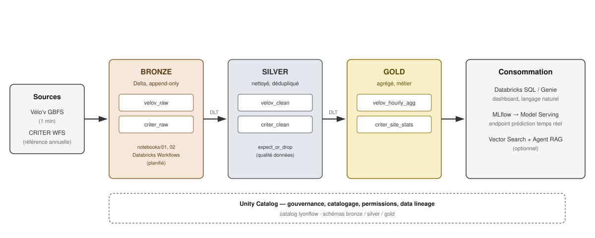

# Architecture

## Vue d'ensemble



Version texte équivalente :

```
Vélo'v GBFS (JSON, 1 min)  ─┐
                             ├─► Bronze (Delta, raw, append-only)
CRITER comptages trafic  ───┘

Bronze ──[DLT: nettoyage, dédup, typage]──► Silver (Delta, qualité contrôlée)

Silver ──[DLT: agrégations horaires/journalières]──► Gold (Delta, tables métier)

Gold ──► Databricks SQL / Genie (dashboard, questions langage naturel)
Gold ──► MLflow (entraînement modèle prédiction dispo/trafic) ──► Model Registry ──► Model Serving (endpoint temps réel)
Gold + docs projet ──► Vector Search (optionnel) ──► Agent RAG (Model Serving)

Databricks Workflows orchestre l'ensemble (planification, historique, alerting)
Unity Catalog gouverne l'ensemble (catalogue, schémas, permissions)
```

## Catalogue Unity Catalog

```
lyonflow (catalog)
├── bronze
│   ├── velov_raw        # append-only, 1 snapshot GBFS par ingestion
│   └── criter_raw       # append-only, comptages trafic bruts
├── silver
│   ├── velov_clean       # typé, dédupliqué, stations fermées filtrées
│   └── criter_clean      # typé, dédupliqué, valeurs aberrantes exclues
└── gold
    ├── velov_hourly_agg  # disponibilité moyenne par station / heure
    └── criter_site_stats # dernier snapshot de stats de référence par capteur
```

## Composants Databricks utilisés

| Composant | Rôle |
|---|---|
| Notebooks (Python/SQL) | Exploration, ingestion Bronze |
| Delta Lake | Format de stockage Bronze/Silver/Gold |
| Delta Live Tables (DLT) | Pipeline déclaratif Bronze→Silver→Gold, règles qualité |
| Unity Catalog | Gouvernance, catalogage, permissions |
| Databricks Workflows | Orchestration planifiée |
| MLflow (Tracking + Model Registry) | Suivi/versioning modèle de prédiction |
| Model Serving | Endpoint REST temps réel |
| Databricks SQL / Genie | Dashboard + requêtes langage naturel |
| Vector Search (optionnel) | Agent RAG sur documentation projet |

## Gouvernance & lineage (Unity Catalog)

Chaque table (bronze/silver/gold) est enregistrée dans le catalog `lyonflow`. Unity Catalog trace automatiquement le **data lineage** colonne-à-colonne entre tables dès qu'un pipeline DLT les relie — visible dans **Catalog Explorer → sélectionner une table → onglet Lineage**, sans configuration supplémentaire. C'est ce lineage qui permet de répondre en entretien à "si une colonne Gold est fausse, comment tu remontes la source ?" avec une vraie capture d'écran plutôt qu'une explication abstraite.

Les permissions (GRANT/REVOKE par catalog/schema/table) ne sont pas mises en place ici — projet solo, un seul principal — mais le mécanisme est le même que celui utilisé en entreprise pour cloisonner l'accès par équipe/rôle.

## Dimensionnement compute (nuance Free Edition)

Databricks Free Edition fonctionne en **serverless** : pas de choix manuel de taille de cluster ni de type (Job cluster vs All-Purpose) — Databricks alloue et auto-scale le compute à la demande, avec un quota d'usage gratuit limité (voir les incidents `RESOURCE_EXHAUSTED` rencontrés en Semaine 1-2, résolus en ne faisant tourner qu'une ressource compute à la fois).

En entreprise sur un workspace payant, le choix pertinent serait :
- **Job clusters** (éphémères, moins chers) pour les pipelines planifiés — pas de cluster qui tourne à vide entre deux runs.
- **All-Purpose clusters** réservés au développement interactif en notebook.
- **Autoscaling** activé sur les deux, avec un `min_workers`/`max_workers` dimensionné sur le volume réel (ici, quelques Mo par run — un cluster minimal suffirait).

Le principe reste valable même sans pouvoir le démontrer physiquement sur Free Edition — bon point à expliciter à l'oral plutôt qu'à esquiver.
